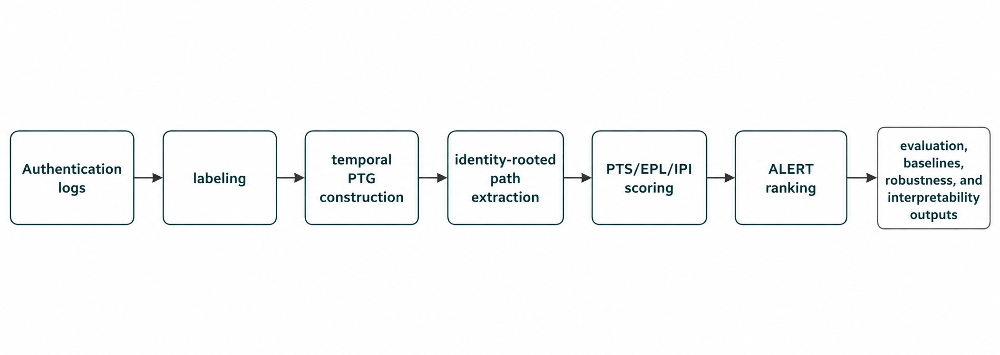
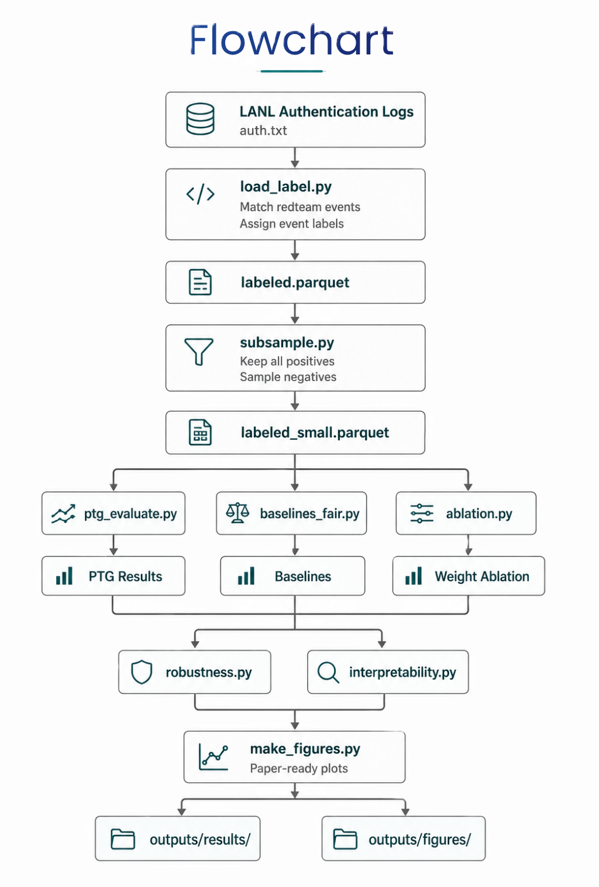
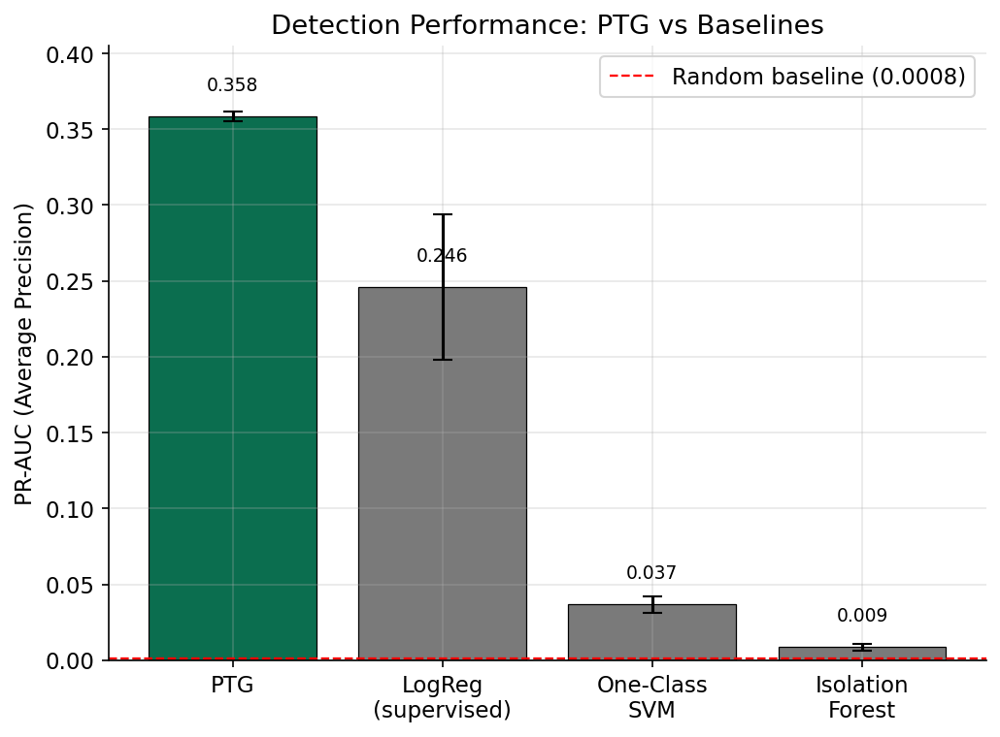
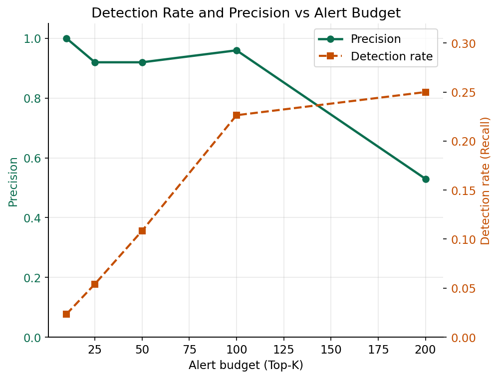
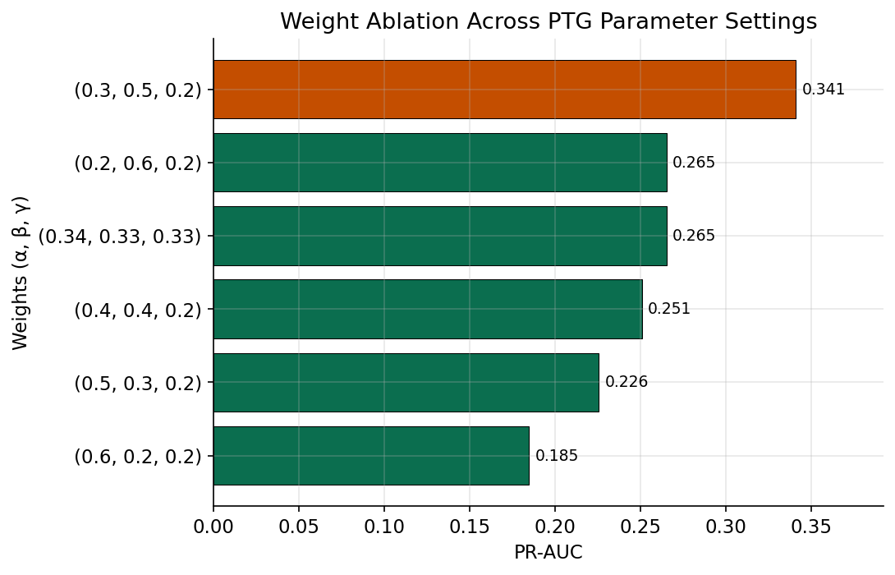

# Privilege Transition Graph (PTG) Framework

A research-oriented cybersecurity framework for detecting lateral movement and privilege-transition activity from authentication logs using temporal graph analysis, path-based anomaly scoring, robustness evaluation, fair baseline comparisons, and campaign-level interpretability.

The framework is designed for reproducible experimentation and produces publication-ready outputs, including figures, metrics, robustness summaries, and interpretability reports.

## Research Contributions

This framework proposes a Privilege Transition Graph (PTG) approach for detecting lateral movement using temporal authentication data.

Key contributions include:

- Construction of temporal Privilege Transition Graphs from authentication events.
- Extraction of identity-rooted privilege transition paths using bounded temporal traversal.
- ALERT scoring that combines:
  - Privilege Transition Score (PTS)
  - Escalation Path Likelihood (EPL)
  - Identity Propagation Index (IPI)
- Evaluation against fair external baselines using equivalent behavioral information.
- ALERT weight ablation to empirically justify scoring parameters.
- Robustness analysis across multiple random negative subsamples.
- Campaign-level interpretability analysis demonstrating PTG's ability to reconstruct attack progression beyond scalar anomaly scores.

## Overview

The framework builds Privilege Transition Graphs from authentication events, scores identity-rooted temporal paths, evaluates alert quality, compares PTG against fair baseline methods, and automatically generates experiment artifacts and figures suitable for research reporting.

The repository structure separates datasets, core logic, data preparation, experiments, orchestration, and generated outputs to improve maintainability and reproducibility.

## Architecture Diagram


## Flowchart

## Repository Structure

```text
project-root/
├── core/
│   ├── ptg_graph.py
│   ├── ptg_scorer.py
│   ├── ptg_evaluate.py
│   └── make_figures.py
│
├── experiments/
│   ├── ablation.py
│   ├── baselines_fair.py
│   ├── robustness.py
│   └── interpretability.py
│
├── data_diagnosis/
│   ├── load_label.py
│   ├── subsample.py
│   └── diagnose_labels.py
│
├── controller/
│   └── ptg_controller.py
│
├── dataset/
│   ├── auth/
│   │   └── auth.txt (not uploaded here for security and access-control reasons)
│   └── redteam.txt (not uploaded here for security and access-control reasons)
│
└── outputs/
    ├── data/
    │   ├── labeled.parquet (will be generated on execution of the programmes)
    │   └── labeled_small.parquet (will be generated on execution of the programmes)
    │
    ├── results/
    │   ├── ptg_results.json
    │   ├── ptg_scored.csv
    │   ├── baselines_fair.json
    │   ├── weight_ablation.csv
    │   ├── robustness.json
    │   ├── interpretability.json
    │   └── example_campaigns.json
    │
    ├── figures/
    │   ├── fig1_pr_curve.png
    │   ├── fig2_budget_curve.png
    │   ├── fig3_baseline_bars.png
    │   └── fig4_weight_ablation.png
    │
    └── logs/
```

## Dataset

Experiments are designed around the Los Alamos National Laboratory (LANL) authentication dataset and its associated red-team activity logs.

Expected dataset placement:

```text
dataset/
├── auth/
│   └── auth.txt
└── redteam.txt
```

This repository does not redistribute the LANL dataset. Users must obtain access separately and place the files in the expected directory structure.

## Methodology

The PTG pipeline follows these stages:

1. Label authentication events using red-team ground truth.
2. Construct temporal PTG snapshots using sliding time windows.
3. Extract identity-rooted privilege transition paths.
4. Learn benign behavioral baselines.
5. Compute:
   - PTS: Privilege Transition Score
   - EPL: Escalation Path Likelihood
   - IPI: Identity Propagation Index
6. Combine these scores into the ALERT metric:

```text
ALERT = α·PTS + β·EPL + γ·IPI
```

7. Evaluate detection performance using:
   - PR-AUC
   - ROC-AUC
   - Detection rate at alert budgets
   - Precision at alert budgets
   - Recall at fixed false-positive rates
   - Mean Time To Detect (MTTD)
8. Compare PTG against fair baseline methods.
9. Assess robustness and interpretability.

## Results
Evaluated on the LANL Comprehensive dataset with real red-team ground truth
(424 recovered malicious authentications, ~500K benign sample).
| Method | PR-AUC | Supervised |
|---|---|---|
| **PTG (path-based)** | **0.331 ± 0.018** | No |
| Logistic Regression (reference) | 0.194 ± 0.040 | Yes |
| One-Class SVM | 0.023 ± 0.007 | No |
| Isolation Forest | 0.003 ± 0.001 | No |

PTG achieves top-25 precision of 0.976 ± 0.048 and surfaces 56.6% of the
red-team host footprint within the top-25 reconstructed campaigns.




## Core Components

### Data Preparation

#### `load_label.py`
- Streams LANL authentication logs in chunks.
- Restricts processing to red-team periods plus benign context.
- Assigns edge types.
- Matches events against red-team labels.

#### `subsample.py`
- Creates tractable evaluation datasets.
- Retains all positives while sampling negatives efficiently.

#### `diagnose_labels.py`
- Assists with investigating label mismatches.

### PTG Pipeline

#### `ptg_graph.py`
- Builds temporal PTG snapshots.
- Extracts bounded identity-rooted paths.

#### `ptg_scorer.py`
- Computes PTS, EPL, IPI, and ALERT scores.

#### `ptg_evaluate.py`
- Produces PTG detection metrics and scored outputs.

### Experiments

#### `ablation.py`
- Performs ALERT weight sensitivity analysis.

#### `baselines_fair.py`
- Evaluates fair feature-vector baselines:
  - Isolation Forest
  - One-Class SVM
  - Temporal Logistic Regression

#### `robustness.py`
- Repeats experiments across multiple seeds.

#### `interpretability.py`
- Reconstructs identity-level campaigns to quantify PTG interpretability.

### Orchestration

#### `ptg_controller.py`
- Provides a menu-driven interface.
- Performs health checks.
- Manages stage execution.
- Captures logs.
- Supports force rebuilds.
- Generates publication-quality figures.

## Requirements

Python 3.10 or newer is recommended.

Required packages:

```bash
pip install pandas numpy networkx scikit-learn matplotlib pyarrow
```

The controller automatically checks for required dependencies before execution.

## Quick Start

### Clone the repository

```bash
git clone <repository-url>
cd <repository-folder>
```

### Create and activate a virtual environment

Linux/macOS:

```bash
python -m venv .venv
source .venv/bin/activate
```

Windows PowerShell:

```powershell
python -m venv .venv
.venv\Scripts\Activate.ps1
```

### Install dependencies

```bash
pip install pandas numpy networkx scikit-learn matplotlib pyarrow
```

### Verify dataset placement

```text
dataset/
├── auth/
│   └── auth.txt
└── redteam.txt
```

### Launch the controller

```bash
python controller/ptg_controller.py
```

## Typical Workflow

### Full Pipeline

Choose:

- `2` → Run Pipeline
- `3` → Force Rebuild

The controller executes:

- Label generation
- Negative subsampling
- PTG evaluation
- Fair baselines
- ALERT ablation
- Robustness studies
- Interpretability analysis
- Figure generation

### Individual Stages

The controller also supports independent execution of:

- Label generation
- Subsampling
- PTG evaluation
- Fair baselines
- Ablation
- Robustness
- Interpretability
- Figure generation

## Output Locations

| Folder | Purpose |
|---|---|
| `outputs/data/` | Labeled datasets and subsamples |
| `outputs/results/` | Experimental metrics and reports |
| `outputs/figures/` | Publication-quality figures |
| `outputs/logs/` | Stage-specific execution logs |

## Generated Figures

The framework automatically produces:

- Precision–Recall curves
- Detection rate versus alert budget plots
- PTG versus baseline PR-AUC comparisons
- ALERT weight ablation visualizations

## Runtime Considerations

Approximate computational cost:

| Stage | Relative Cost |
|---|---|
| Label generation | High |
| Subsampling | Moderate |
| PTG evaluation | High |
| Fair baselines | Moderate |
| Ablation | High |
| Robustness | Very High |
| Interpretability | Moderate |
| Figure generation | Low |

Stages are executed independently to improve memory management and fault isolation.

## Reproducibility

The framework supports reproducible experimentation through:

- Fixed random seeds
- Saved intermediate datasets
- Stage-level logging
- Persistent result files
- Force-rebuild functionality

Experiments can therefore be resumed without rerunning completed stages.

## Example Commands

### PTG Evaluation

```bash
python core/ptg_evaluate.py \
    --data outputs/data/labeled_small.parquet \
    --delta 3600 \
    --max-depth 4
```

### Fair Baselines

```bash
python experiments/baselines_fair.py \
    --data outputs/data/labeled_small.parquet \
    --delta 3600
```

### Robustness Analysis

```bash
python experiments/robustness.py \
    --small outputs/data/labeled_small.parquet \
    --seeds 5
```

## Future Work

Potential extensions include:

- Graph neural network baselines
- Streaming PTG construction
- SIEM integration
- Additional public datasets
- Real-time deployment studies
